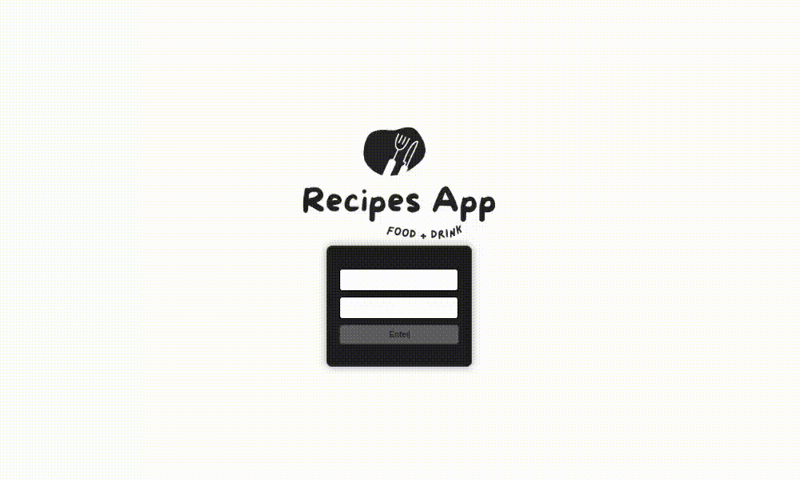

  <b>
    <a href="#----">English version README 🇺🇸 </a> •
    <a href="#--">README em Português 🇧🇷</a>
  </b>

 
 

 
   
 <h1> 🇧🇷 </h1> 

 
 
 
<section>
  <table align="center">
   <tr>

    <b>
      <td> <a href="#----sobre--">Sobre</a></td> 
      <td>  <a href="#tecnologias-utilizadas--hard-skills-">Tecnologias Utilizadas</a></td> 
      <td>  <a href="#layout">Layout</a></td>
     </b>
    

   </tr>
  </table>
 

  <h2 align="left">
    Sobre
  </h2>
  <table>
    <tr>
      <td> 
        
Foi desenvolvido um app de receitas, utilizando conceitos modernos e atuais do React, que é o Hooks e o Context API. Foi um projeto em grupo, simulando um aplicativo de receitas completo.
        

        <blockquote>
          Um dos maiores projetos que fizemos na Trybe, com 87 requisitos para serem implementados e/ou criados.
          </blockquote>
          <!--          
 Uma ótima simulação, com direito a login, favoritar e desfavoritar receitas, página de receita feitas, com direito a uma checklist, página de pesquisas e filtragens por categorias.
 -->
          
<b>Redux</b> | <b>biblioteca React-Redux</b> | <b>Context API do React</b> | <b>React Hook</b> <i>( useState, useContext, useEffect, Hooks customizados )</i>
          

    </tr>
    <tr>
      <td> 
        

          <b>Esse projeto foi desenvolvido por:</b>
          <a href="https://www.linkedin.com/in/vanehsann/" target="_blank"> Vanessa Santos </a>,
          <a href="https://www.linkedin.com/in/rogerconsul/" target="_blank"> Róger Consul </a>,
          <a href="https://www.linkedin.com/in/fefcufe/" target="_blank"> Fernanda Ferreira </a>,
          <a href="https://www.linkedin.com/in/alex-horman-510094226/" target="_blank"> Alex Hornan </a> e
          <a href="https://www.linkedin.com/in/vitormemoria/" target="_blank"> Vitor Memoria</a>
          como estudantes de desenvolvimento web na <b><a href="https://www.betrybe.com/" target="_blank"> Trybe </a></b>
        

      </td>
    <tr>
    <tr>
      <td> 
        

          <b>Módulo:</b> Front-end
        

      </td>
    </tr>

  </table>

 
 

   <h2>Trabalhando atualmente</h2>
   <table>
  <tr>
    <td>
      <b>Metas</b>
    </td>
    <td>
      <b>Urgência</b>
    </td>
  </tr>
     <tr>
    <td>Add README and site English Version</td>
    <td>🟢</td>
  </tr>

</table>

 
 

    <h2 align="left">
Tecnologias utilizadas ( Hard Skills )
</h2>
    <table>
      
 <tr><td>
 - Unit & Bash
 </tr></td> 
 <tr><td> 
     - Git & GitHub
 </tr></td> 
 <tr><td> 
 - JSX
 </td></tr> 
  <tr><td> 
 - React: Redux | biblioteca React-Redux  | Context API do React | React Hook ( useState, useContext, useEffect, Hooks customizados )
 </td></tr>
   <tr><td> 
 - Metodologias Agéis: Kaban.
 </td></tr>
    </table>
  

  
 
 

    <h2 align="left">
Layout
</h2>
 <table>  
 <tr>
  <td></td></tr>
 <tr><td> 

 </td></tr> 
    </table>
  

  </section>

  
   
  <h1 align="center">  🇺🇸  </h1>
  
 Soon 

